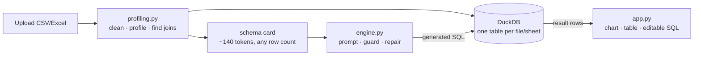

# State

## Current focus
Take-home complete and verified. Deliverables in place: working app, repo, README,
write-up. Remaining work is the candidate's — record the demo, push to GitHub.

## Shape

## Done
- Multi-file upload, CSV and Excel, one table per sheet, per-file failure isolation
- Cross-file analysis via containment-scored join discovery
- Six demo questions verified against an independent pandas computation
- Shape-based chart selection, sanity-checked against the model's suggestion
- Per-column visual profiles (distribution, time coverage, top values) before any question
- Editable, re-runnable SQL under every answer
- Business definitions as configuration (`config/metrics.toml`), cited under answers
- Privacy mode (`SEND_SAMPLES=false`), per-question JSONL trace with an in-app panel
- Eval harness with ablation: every component scored by what breaks without it
- CI running the stubbed suite on every push
- 17 stubbed assertions, 5 live assertions, 1M-row benchmark (~9s ingest, 561-char prompt)

## In progress
Nothing.

## Blocked
Codex second-opinion review — the ChatGPT account's Codex quota is exhausted until
2026-09-28. It read every source file, then hit the limit before producing findings.
The review in this repo is therefore self-review, not cross-model.

## Known gaps
- Definitions are a prompt instruction, not compiled SQL; the model can still ignore one.
  The evals catch it when it does. See [ADR 0007](decisions/0007-business-definitions-as-configuration.md).
- Throughput is bounded by the API: ~5 questions/minute for the whole app on the free tier.
- Single session, in-memory, no auth.
- Very wide tables (200+ columns) would need schema cards trimmed to the columns a
  question plausibly touches.
- Questions needing window functions or statistical tests work only as well as the
  model's SQL.
