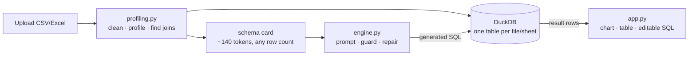

# State

## Current focus
Take-home complete and verified. Deliverables in place: working app, repo, README,
write-up. Remaining work is the candidate's — record the demo, push to GitHub.

## Shape

## Done
- Multi-file upload, CSV and Excel, one table per sheet, per-file failure isolation
- Cross-file analysis via containment-scored join discovery
- Six demo questions verified against an independent pandas computation
- Shape-based chart selection; editable, re-runnable SQL under every answer
- 11 stubbed assertions, 5 live assertions, 1M-row benchmark (8.7s ingest, 561-char prompt)

## In progress
Nothing.

## Blocked
Codex second-opinion review — the ChatGPT account's Codex quota is exhausted until
2026-09-28. It read every source file, then hit the limit before producing findings.
The review in this repo is therefore self-review, not cross-model.

## Known gaps
- No semantic layer. "Revenue" means net-of-refunds only because the model chose it;
  nothing pins that definition down. See [ADR 0002](decisions/0002-text-to-sql-over-rows-in-prompt.md).
- Single session, in-memory, no auth.
- Very wide tables (200+ columns) would need schema cards trimmed to the columns a
  question plausibly touches.
- Questions needing window functions or statistical tests work only as well as the
  model's SQL.
